# Design Report: White-box FDS

## 1. Introduction

**1.1 Summary**

본 프로젝트는 기존 AI 기반 이상거래 탐지 시스템(FDS)이 지닌 블랙박스 모델의 한계를 극복하고, 탐지 과정과 결과의 100% 추적이 가능한 화이트박스 FDS 구축을 목표로 한다.

최근 고도화되는 스머핑(분할 송금) 등 금융 범죄에 대응하기 위해 실시간 데이터 처리 능력은 필수이나 기존 시스템은 단순히 위험도 수치만을 반환하여 관리자가 즉각적인 차단 사유를 고객이나 감독 기관에 명확히 소명하기 어려워 실제 행정에 불편함을 야기한다. 따라서 실시간 거래 데이터를 정렬 및 검색 파이프라인을 구축하고, 위반 규칙과 명확한 증거 내역이 포함된 화이트박스 로그를 생성하여 금융 거래의 투명성과 신뢰성을 극대화한다.

**1.2 Design Goals**

성공적인 화이트박스 FDS 구현을 위해 본 프로젝트는 다음 세 가지 핵심 목표를 기반으로 설계하고자 한다.

* **관제 화면과 탐지 엔진의 독립(안정성 확보)** : 데이터 처리 로직과 사용자 화면(UI)을 철저하게 분리. 이를 통해 대용량의 금융 데이터가 유입되어 엔진이 바쁘게 연산하는 중에도 관리자의 대시보드는 끊김 없이 실시간으로 안전하게 업데이트한다.
* **명확한 증거 제시(투명성 확보)** : 특정 거래가 차단됐을 때 어떤 과거 거래들과 조합되어 이상 징후로 판별됐는지를 관리자에게 명확한 로그로 남겨준다.
* **실시간 탐지(신속성 확보)** : 특정 금액 조합을 빠르게 역추적하는 고성능 자바 엔진을 구축하여 실시간 이상거래 탐지 환경을 제공한다.
---

## 2. Class diagram

**2.1 class diagram**

**2.2 detail of class diagram**

본 화이트박스 FDS 시스템은 크게 순수 데이터를 보관하는 [데이터 엔티티 영역], 실시간으로 데이터를 정렬하고 탐지하는 [코어 엔진 영역], 그리고 외부 시스템(은행망,UI)과 통신하는 [인터페이스 및 제어 영역으로 나뉜다.

**2.2.1 데이터 및 모델 영역**

시스템 내에서 상태를 보관하고 모듈 간 데이터를 전달하는(DTO) 핵심 객체이다.

  1. Transaction(거래 단위 객체)
     * 역할 : 코어뱅킹망에서 유입되는 개별 거래 내역을 담는 불변 객체이다. 시스템의 가장 기본이 되는 데이터 단위.
     * 주요 속성(Attributes) :
       * transactionId : 거래 고유 식별자 (String/UUID)
       * senderAccount / receiverAccount : 송금인 및 수취인 계좌번호
       * amount : 거래 금액 (Double)
       * timestamp : 거래 발생 시각 (Long,Epoch Time)
       * status : 현재 거래의 상태 (String - PENDING,SAFE,BLOCKED)
     * 주요 메서드(Methods) :
       * getTransactonInfo() : 거래 상세 정보를 문자열이나 JSON 형태로 반환.
       * updateStatus() : 엔진의 판별 결과에 따라 거래 상태를 갱신.
      
  2. WhiteBoxLog(화이트박스 증거 객체)
     * 역할 : 스머핑 등 이상 거래가 적발되었을 때, 관리자에게 왜 차단되었는지 설명할 수 있는 구체적인 물증을 조립하는 객체이다.
     * 주요 속성(Attributes) :
       * logId : 로그의 고유 식별 번호
       * ruleName : 위반한 탐지 규칙의 명칭(예: 고액_분할송금_룰)
       * detectedTime : 이상 징후가 시스템에 의해 탐지된 시각
       * evidenceTransactions : 이상 거래로 판별된 원본 거래 객체들의 배열/리스트
     * 주요 메서드(Methods) :
       * createLog() : 룰 엔진으로부터 넘겨받은 증거 거래들을 조합하여 직관적인 텍스트 형태의 보고서로 포맷팅.
      
  3. Admin(관리자 객체)
     * 역할 : 대시보드에 접근하여 시스템을 관제하고 계좌를 수동으로 제어하는 관리자의 세션 정보를 담음.
     * 주요 속성(Attributes) :
       * adminId : 사번
       * password
       * department : 소속 부서
       * name : 이름
     * 주요 메서드(Methods) :
       * login() : 세션 생성
       * logout() : 세션 파기

**2.2.2 코어 엔진 영역**

유입되는 데이터를 가공하고, 수학적 알고리즘을 통해 범죄 징후를 연산하는 시스템의 심장부.

  4. DataPipelint(데이터 정렬 및 파이프라인)
     * 역할 : CoreBankingAdapter 로부터 받은 raw 데이터를 객체로 변환하고, 룰 엔진이 탐지하기 쉽도록 시간으로 정렬된 상태를 항시 유지.
     * 주요 속성(Attributes) :
       * rawData : 외부에서 들어온 원시 JSON 또는 텍스트 데이터
       * transactionArray : 파싱된 Transaction 객체들이 담기는 배열
     * 주요 메서드(Methods) :
       * perseToTransaction() : 들어온 raw 데이터를 파싱하여 Transaction 객체를 생성.
       * searchPositionByTime() : (핵심) 새로 유입된 거래가ㅏ 배열의 어느 위치에 들어가야 할지 탐색.
       * insertData() : 위에서 찾은 인덱스 위치에 데이터를 삽입하여, 배열이 항상 시간순 정렬 상태를 유지하도록 함.

  5. RuleEngine(실시간 이상거래 탐지 엔진)
     * 역할 : 정렬된 데이터 파이프라인을 감시하며, 정의된 임계치를 초과하는 거래조합을 실시간으로 적발.
     * 주요 속성(Attributes) :
       * activeRules : 현재 활성화된 탐지 룰 세트 및 임계치 정보
     * 주요 메서드(Methods) :
       * detectSmurfing() : (핵심) 분할 송금(스머핑)을 탐지.
       * detectHighAmount() : 단일 고액 거래(기준치 초과)를 즉각 탐지
       * groupEvidence() : 탐지 로직에서 적발된 배열 내의 특정 인덱스(거래)들을 묶어 WhiteBoxLog 객체로 생성해 반환
       * updateRuleSettings() : 시스템 재시작 없이 런타임 중에도 탐지 임계치를 동적으로 변경.
      
**2.2.3 입출력 및 제어 영역**

데이터베이스 통신, 화면 출력, 코어뱅킹망과의 네트워크 제어를 담당.

 6. CoreBankingAdapter(코어뱅킹 어댑터)
     * 역할 : 실제 은행의 core banking과 통신.
     * 주요 속성(Attributes) :
       * coreIp : 서버 IP
       * port : 포트 번호
     * 주요 메서드(Methods) :
       * receiverData() : Socket 통신이나 Rest API를 통해 실시간으로 발생하는 은행 거래 데이터를 수신하여 DataPipeline으로 넘김.
       * sendBlockCommand() / sendUnblockCommand() : 룰 엔진이 이상 거래를 적발하면, 해당 계좌번호를 실제 은행망에 전송하여 출금을 정지(Lock)시키는 명령 수행.
      
  7. AccountController(계좌 제어 컨트롤러)
     * 역할 : 룰 엔진의 자동 탐지 겨로가 또는 관리자의 수동 판단에 따라 대상 계좌의 상태를 제어.
     * 주요 속성(Attributes) :
       * targetAccount : 제어 대상 계좌.
       * authCode : 관리자 권한 인증 코드.
       * amount : 거래 금액 (Double)
       * timestamp : 거래 발생 시각 (Long,Epoch Time)
       * status : 현재 거래의 상태 (String - PENDING,SAFE,BLOCKED)
     * 주요 메서드(Methods) :
       * executeUnlock() : 소명이 완료된 계좌의 차단을 해제.
       * executeManualLock() : 관리자가 대시보드에서 특정 계좌를 수동으로 차단할 때 호출.
      
  8. LogRepository(로그 저장소)
     * 역할 : 데이터베이스(DB)와 통신하여 생성된 WhiteBoxLog를 영구적으로 저장하고 관리.
     * 주요 속성(Attributes) :
       * dbUrl : 데이터베이스 접속 주소
     * 주요 메서드(Methods) :
       * saveLog() : 적발된 화이트박스 로그를 DB에 INSERT.
       * fetchLogById() / fetchAllLogs() : 대시보드에서 과거의 차단 내역을 조회할 때 조건에 맞춰 데이터를 SELECT.
      
  9. DashboardManager(관제 대시보드 매니저)
     * 역할 : 관리자가 보는 화면(UI)에 실시간 탐지 현황을 뿌려주고 알림을 발생.
     * 주요 속성(Attributes) :
       * normalCount : 정상 거래 수.
       * blockedCount : 차단 건수.
       * activeSessions : 현재 접속 중인 관리자 수.
     * 주요 메서드(Methods) :
       * updateStatistics() : 실시간으로 유입되는 정상/차단 거래 비율을 계산하여 화면의 통계 그래프 수치를 갱신.
       * sendAlertPush() : RuleEngine 에서 치명적인 스머핑이 적발될 경우, 관리자 화면에 즉각적으로 경고 팝업이나 푸시 알림(WebSocket 활용)을 전송.
---

## 3. Sequence diagram

**3.1 Admin System Login & Session Management**
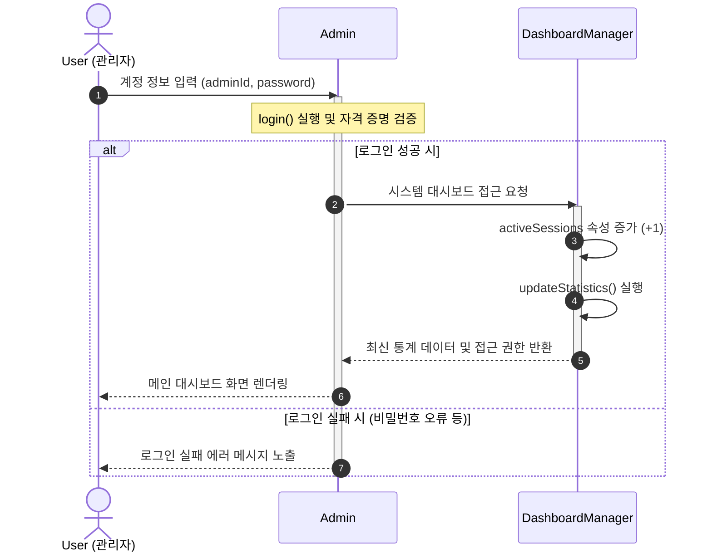
위 그림은 관리자가 시스템에 접속하여 권한을 얻고 대시보드 모니터링을 시작하는 비즈니스 과정이다. 사용자가 계정 정보를 입력하면 Admin 객체가 활성화(Activation)되어 내부적으로 login() 메서드를 통해 자격 증명을 검증한다. 이 과정에서 조건 분기(alt/else)가 발생한다. 로그인이 성공할 경우 Admin은 DashboardManager에게 접근을 요청하고 DashboardManager는 현재 모니터링 중인 세션을 관리하기 위해 activeSessions를 증가시킨 후 updateStatistics()를 통해 최신 지표를 갱신하여 반환한다. 반면 로그인에 실패할  경우, 시스템 리소스를 추가로 호출하지 않고 즉시 사용자에게 실패 메시지를 반환하며 Admin 객채의 활성화가 종료된다.

**3.2 Core Banking Data Ingestion**
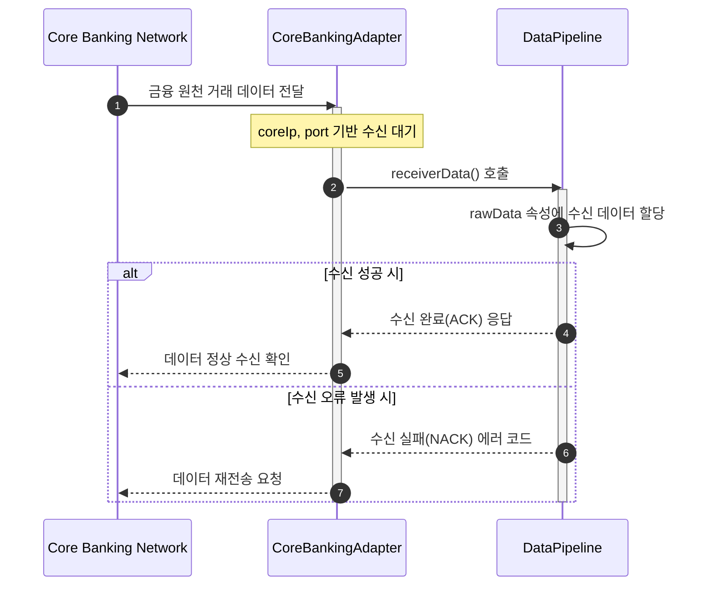
위 그림은 코어뱅킹 시스템에서 발생한 원천 거래 데이터를 어댑터를 통해 안전하게 수신하는 과정이다. 금융 거래가 발생하면 수신 대기 중이던 CoreBankingAdapter가 활성화되어 데이터를 넘겨받고 DataPipeline의 receiverData()를 호출한다. 이후 데이터의 무결성에 따라 처리가 분기된다. 데이터가 손실 없이 100% 수신되었다면 어댑터를 거쳐 코어뱅킹 망에 정상 수신(ACK)를 알리고 오류가 발생했다면 즉시 재전송을 요청하는 예외 처리가 비즈니스 로직 내에 포함되어 있다.

**3.3. Transaction Parsing & Pipeline Buffering**
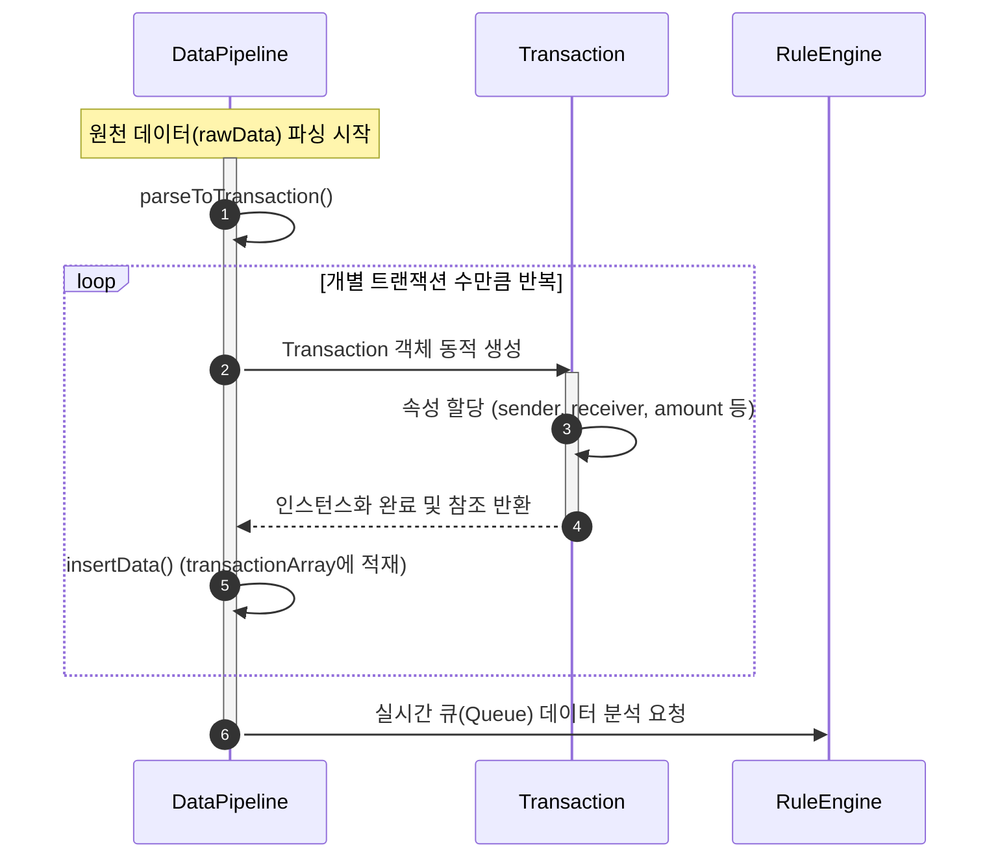
위 그림은 수신된 원천 바이트 데이터를 시스템이 인식할 수 있는 의미 있는 객체로 변환하고 큐에 적재하는 과정이다. DataPipeline이 활성화되어 parseToTransaction()을 수행하면 반복문(loop)을 통해 대량의 데이터를 개별 단위로 분리한다. 분리된 각 거래 건에 대해 새로운 Transaction 객체가 생성되고 활성화되며 이 객체 내부에서 계좌번호와 금액 등의 속성 할당이 이루어진다. 객체 생성이 완료되면 DataPipeline은 insertData()를 호출하여 내부 배열인 transactionArray에 데이터를 차곡차곡 적재하며 모든 적재가 끝나면 RuleEngine을 호출하여 실시간 분석의 트리거를 당긴다.

**3.4. High Amount Detection Process**
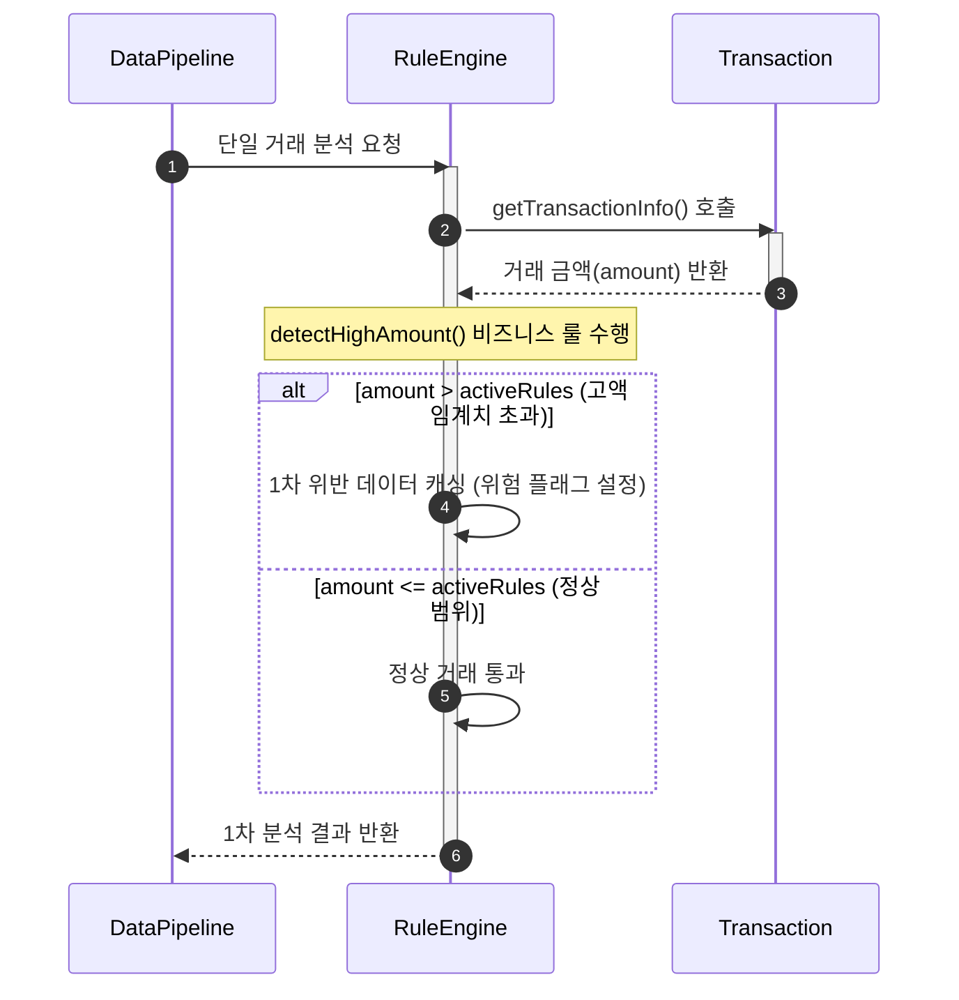
위 그림은 룰 엔진이 거래 금액을 바탕으로 고액 이상거래를 실시간 탐지하는 핵심 비즈니스 로직이다. 분석 요청을 받은 RuleEngine은 해당 Transaction 객체를 활성화하여 getTransactionInfo()로 금액 데이터(amount)를 추출한다. 이후 detectHighAmount() 로직 내에서 현재 시스템에 설정된 고액 임계치(activeRules)와 실제 거래 금액을 대조하는 조건 분기가  발생한디. 기준치를 초과하느 고액 거래로 판별될 경우 해당 거래는 내부적으로 위험 거래로 식별되어 캐싱되며, 정상적인 소액 거래일 경우 그대로 패스되어 1차 분석이 종료된다.

**3.5. Smurfing (Split Transfer) Detection Process**
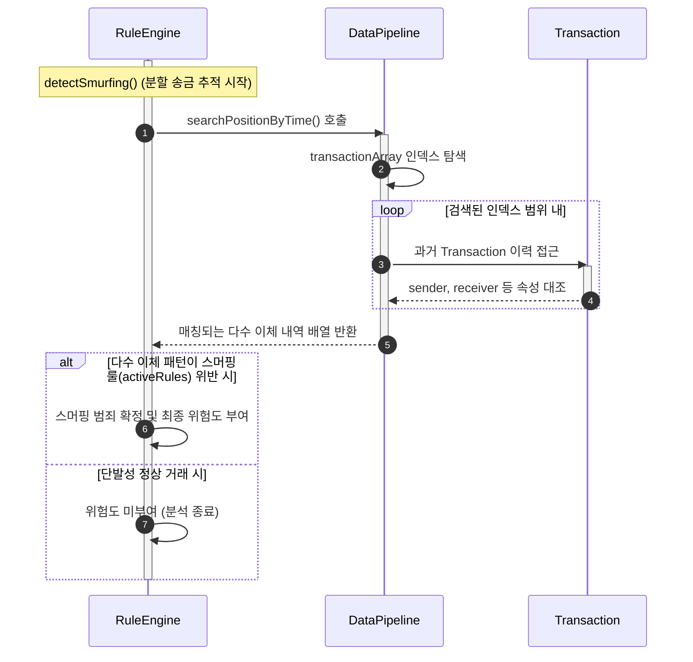
위 그림은 범죄 자금을 잘게 쪼개어 보내는 스머핑 수법을 탐지하기 위해 과거 거래 이력을 훑어내는 과정이다. 활성화된 RuleEngine이 detectSmurfing()을 실행하면 시간대 추적을 위해 DataPipeline의 searchPositionByTime()을 호출한다. DataPipeline은 반복문을 통해 배열의 저장된 과거 Transaction 객체들을 활성화하며 속성(송/수신자 일치 여부 등)을 대조한다. 유사한 패턴의 이체 내역이 배열로 묶여 반환되면 RuleEngine은 조건문(alt)을 통해 이 반복 패턴이 시스템에 설정된 스머핑 룰을 명백히 위반했는지 최종적으로 판가름한다.

**3.6. Evidence Grouping & White-box Log Creation**
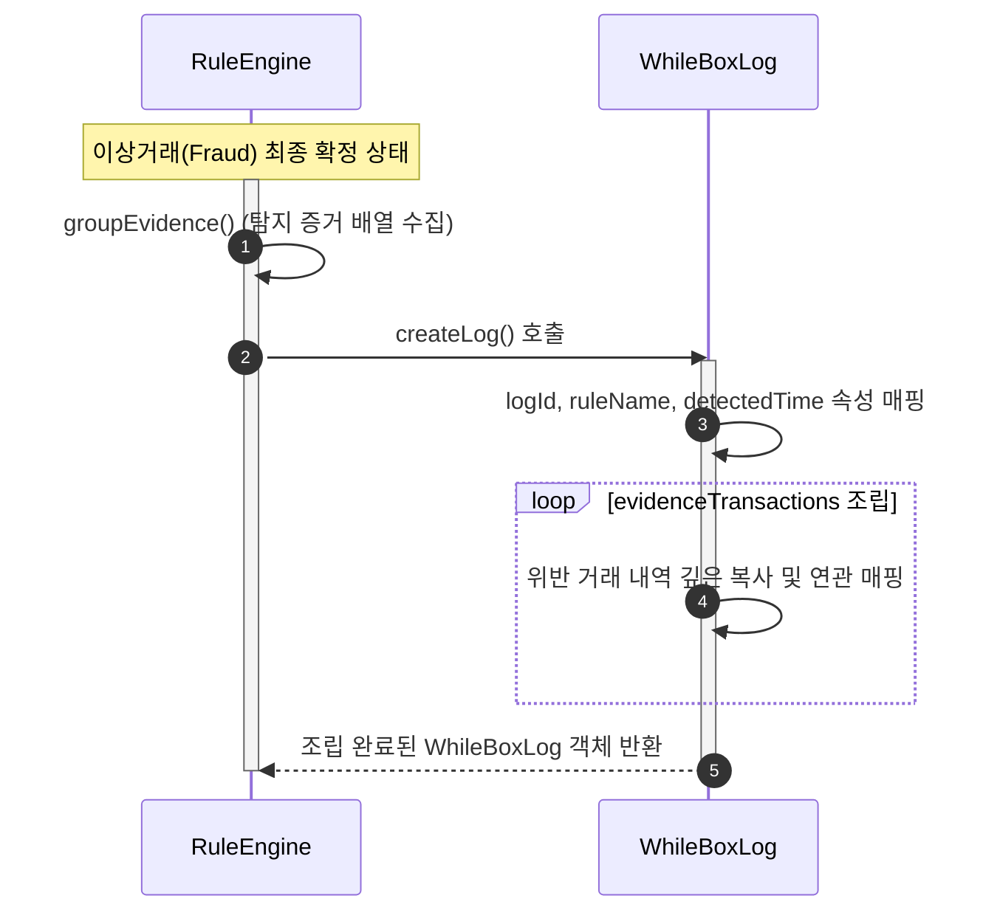
위 그림은 앞선 로직에서 이상거래가 확정되었을 때 이를 투명하게 증명하기 위한 텍스트 기반 화이트박스 로그를 생성하는 과정이다. RuleEngine은 groupEvidence()를 통해 위반 트랜잭션 정보들을 긁어모은다. 이후 WhiteBoxLog 내에서는 어떤 룰을 위반했는지(ruleName)와 언제 적발되었는지(detectedTime)를 기록하며 반복 루프를 통해 모아둔 증거 데이터들을 evidenceTransactions 속성에 차례대로 병합하여 하나의 완성된 논리적 설명(Log) 객체로 만들어 반환한다.

**3.7. Log Persistence & Database Storage**
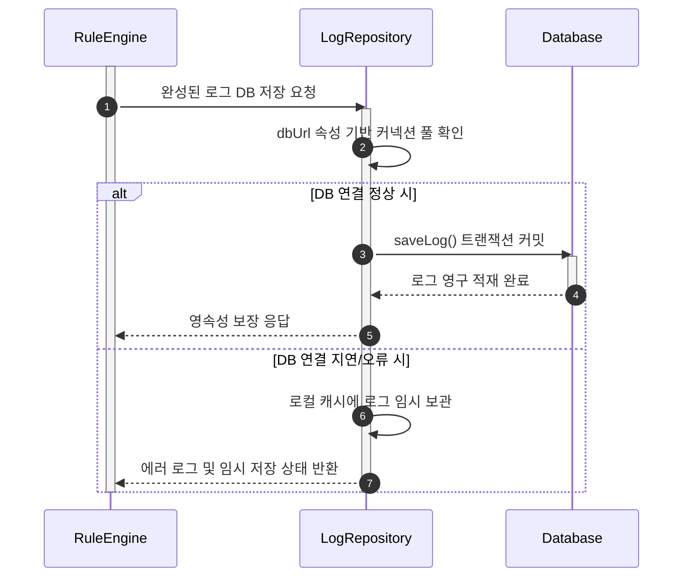
위 그림은 생성된 화이트박스 로그가 유실되지 않도록 데이터베이스에 영구적으로 기록하는 과정이다. 로그를 건네받은 LogRepository가 활성화되면 가장 먼저 dbUrl을 체크하여 데이터베이스와의 통신 상태를 확인한다. 여기서 조건 분기가 발생하여 커넥션이 정상이면 saveLog()를 통해 완벽하게 적재를 완료한다. 하지만 네트워크 장애나 DB 서버 다운 등으로 연결에 문제가 생겼을 경우 비즈니스 연속성을 해치지 않기 위해 로그를 버리지 않고 로컬 캐시에 임시 보관하는 예외 처리 흐름이 포함되어 시스템의 안전성을 챙긴다.
**3.8. Automated Block Command & Dashboard Alert**
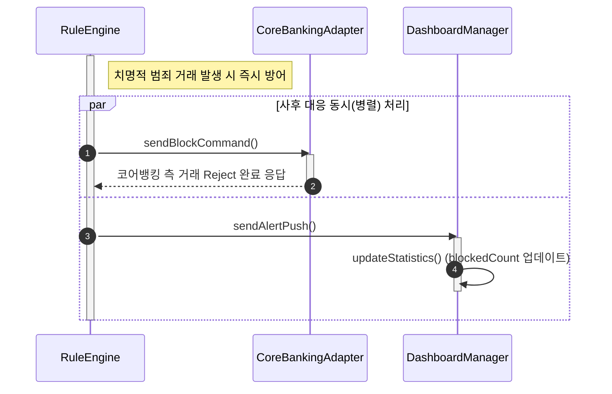
위 그림은 치명적인 금융 사고를 사전에 차단하기 위해 원장망에 제어 명령을 내리고 관리자에게 상황을 전파하는 과정이다. 로그 저장이 끝난 RuleEngine은 피해를 막기 위해 병렬 처리(par)를 시작한다. 한쪽으로는 CoreBankingAdapter를 통해 즉각적인 거래 중지 및 계좌 제한 명령인 sendBlockCommand()를 내보내어 실물 자금의 이동을 막고, 다른 한쪽으로는 DashboardManager에게 sendAlertPush()를 날린다. 알림을 받은 대시보드는 실시간으로 화면의 차단 건수(blockedCount) 지표를 갱신하여 관리자의 즉각적인 개입을 유도한다.

**3.9. FDS Log Data Inquiry & Audit**
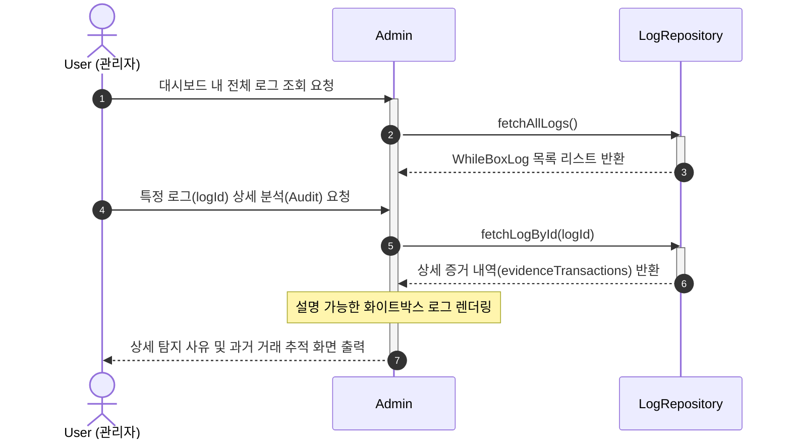
위 그림은 관리자가 시스템에 축적된 이상거래 차단 이력과 생성된 화이트박스 로그를 심층 조회하는 과정이다. 관리자가 조회를 요청하면 Admin은 LogRepository를 활성화하여 fetchAllLogs()를 통해 저장된 전체 로그 목록을 뿌려준다. 이후 관리자가 특정 거래에 대한 감사가 필요하여 해당 건을 클릭하면, 고유한 식별자(logId)를 기반으로 fetchLogById()가 재차 호출된다. 반환된 로그에는 시스템이 왜 해당 거래를 차단했는지에 대한 증거 배열(evidenceTransactions)이 포함되어 있으며, Admin은 이를 시각화하여 렌더링함으로써 관리자가 시스템의 판단 근거를 사람이 읽을 수 있는 형태로 제공받게 된다.

**3.10. Manual Account Lock Execution**
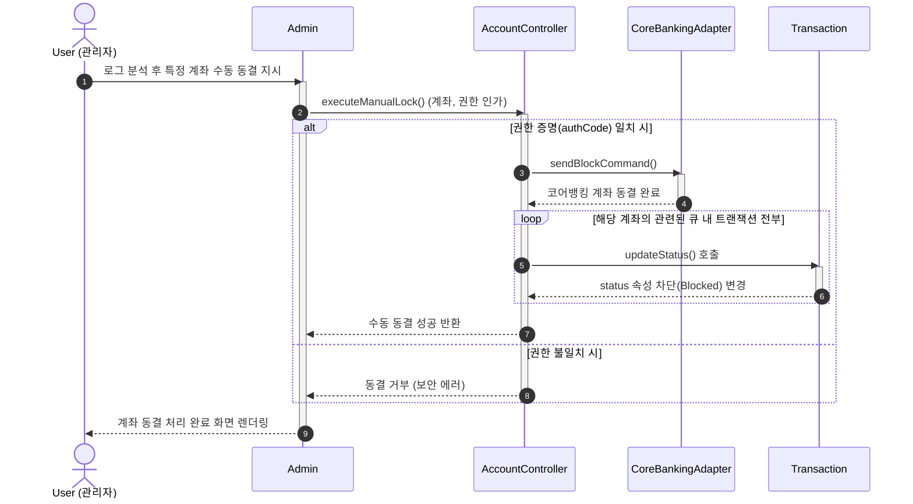
위 그림은 관리자가 로그를 검토한 뒤, 시스템이 자동 차단하지 못한 추가적인 위험성을 인지하여 특정 계좌 전체를 수동으로 동결하는 과정이다. 관리자가 수동 동결을 지시하면 AccountController가 활성화되어 executeManualLock()을 수행한다. 이때 입력된 관리자 권한(authCode)이 적절한지 판단하는 조건문이 실행되며, 권한이 승인되면 CoreBankingAdapter를 통해 즉시 계좌를 물리적으로 잠근다. 그 후 시스템 무결성을 위해 반복문(loop)을 가동하여 현재 메모리에 떠 있는 해당 계좌 관련 Transaction 객체들의 status를 모두 강제로 'Blocked' 상태로 덮어씌워 갱신하고 처리를 완료한다.

**3.11. Manual Account Unlock Execution**
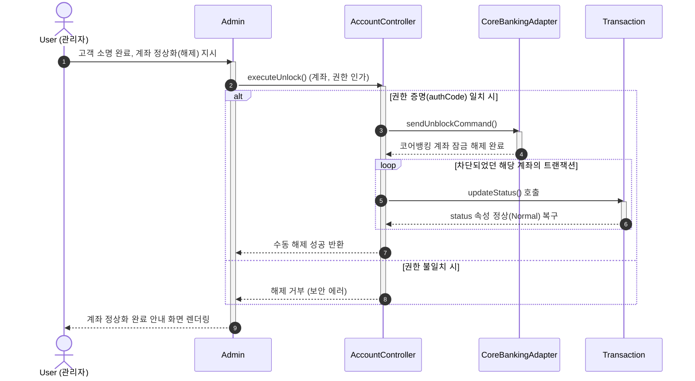
위 그림은 자동 차단되었거나 수동 동결되었던 계좌에 대해 사용자가 정상적인 거래임을 소명했을 때, 관리자 권한으로 시스템 제한을 복구하는 과정이다. 3.10 과정과 동일하게 AccountController가 활성화되어 권한을 검증한다. 검증을 통과하면 CoreBankingAdapter를 통해 코어 원장망의 락(Lock)을 푸는 sendUnblockCommand()가 실행된다. 해제가 확정되면 다시 반복문(loop)을 돌면서 묶여있던 Transaction 객체들의 상태 플래그를 'Normal'로 재설정하여 차단 조치를 완전히 백지화하고, 사용자가 정상적으로 금융 서비스를 다시 이용할 수 있게 한다.

**3.12. Rule Setting Update & System Logout**
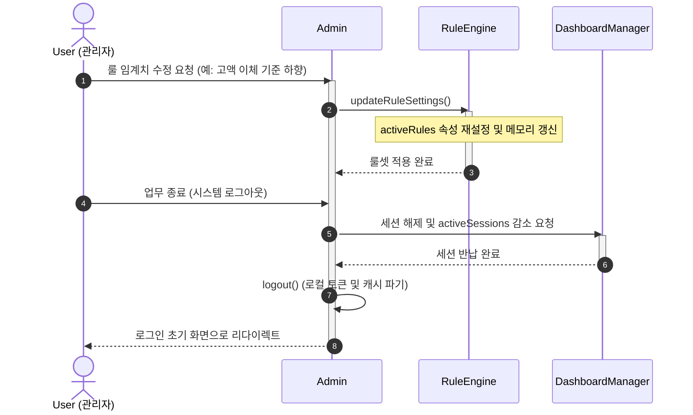
위 그림은 관리자가 새로운 사기 수법에 대응하기 위해 엔진의 환경설정을 변경하고, 업무 종료 후 안전하게 시스템을 빠져나가는 과정이다. 관리자가 룰 변경안을 배포하면 Admin은 RuleEngine의 updateRuleSettings()를 활성화한다. RuleEngine은 운영 중단 없이 메모리에 상주하는 핵심 탐지 파라미터인 activeRules를 새로운 값으로 덮어써 탐지 기준을 최신화한다. 이후 관리자가 로그아웃을 요청하면, Admin은 DashboardManager를 호출하여 현재 점유하고 있던 모니터링 세션을 반납하고, 마지막으로 자체 logout() 메서드를 통해 로컬 인증 정보를 완전히 파기하여 시스템 보안을 유지하며 종료한다.

---

## 4. State machine diagram

**4.1 state machine diagram**

**4.2 detail of state machine diagram**

---

## 5. Implementation requirements

---

## 6. Glossary

---

## 7. References

---
