# Design Report: White-box FDS

## 1. Introduction

**1.1 Summary**

본 프로젝트는 기존 AI 기반 이상거래 탐지 시스템(FDS)이 지닌 블랙박스 모델의 한계를 극복하고, 탐지 과정과 결과의 100% 추적이 가능한 화이트박스 FDS 구축을 목표로 한다.

최근 고도화되는 스머핑(분할 송금) 등 금융 범죄에 대응하기 위해 실시간 데이터 처리 능력은 필수이나 기존 시스템은 단순히 위험도 수치만을 반환하여 관리자가 즉각적인 차단 사유를 고객이나 감독 기관에 명확히 소명하기 어려워 실제 행정에 불편함을 야기한다. 따라서 실시간 거래 데이터를 정렬 및 검색 파이프라인을 구축하고, 위반 규칙과 명확한 증거 내역이 포함된 화이트박스 로그를 생성하여 금융 거래의 투명성과 신뢰성을 극대화한다.

**1.2 Design Goals**

성공적인 화이트박스 FDS 구현을 위해 본 프로젝트는 다음 세 가지 핵심 목표를 기반으로 설계하고자 한다.

* **관제 화면과 탐지 엔진의 독립(안정성 확보)** : 데이터 처리 로직과 사용자 화면(UI)을 철저하게 분리. 이를 통해 대용량의 금융 데이터가 유입되어 엔진이 바쁘게 연산하는 중에도 관리자의 대시보드는 끊김 없이 실시간으로 안전하게 업데이트한다.
* **명확한 증거 제시(투명성 확보)** : 특정 거래가 차단됐을 때 어떤 과거 거래들과 조합되어 이상 징후로 판별됐는지를 관리자에게 명확한 로그로 남겨준다.
* **실시간 탐지(신속성 확보)** : 특정 금액 조합을 빠르게 역추적하는 고성능 자바 엔진을 구축하여 실시간 이상거래 탐지 환경을 제공한다.
---

## 2. Class diagram

**2.1 class diagram**

**2.2 detail of class diagram**

본 화이트박스 FDS 시스템은 크게 순수 데이터를 보관하는 [데이터 엔티티 영역], 실시간으로 데이터를 정렬하고 탐지하는 [코어 엔진 영역], 그리고 외부 시스템(은행망,UI)과 통신하는 [인터페이스 및 제어 영역으로 나뉜다.

**2.2.1 데이터 및 모델 영역**

시스템 내에서 상태를 보관하고 모듈 간 데이터를 전달하는(DTO) 핵심 객체이다.

  1. Transaction(거래 단위 객체)
     * 역할 : 코어뱅킹망에서 유입되는 개별 거래 내역을 담는 불변 객체이다. 시스템의 가장 기본이 되는 데이터 단위.
     * 주요 속성(Attributes) :
       * transactionId : 거래 고유 식별자 (String/UUID)
       * senderAccount / receiverAccount : 송금인 및 수취인 계좌번호
       * amount : 거래 금액 (Double)
       * timestamp : 거래 발생 시각 (Long,Epoch Time)
       * status : 현재 거래의 상태 (String - PENDING,SAFE,BLOCKED)
     * 주요 메서드(Methods) :
       * getTransactonInfo() : 거래 상세 정보를 문자열이나 JSON 형태로 반환.
       * updateStatus() : 엔진의 판별 결과에 따라 거래 상태를 갱신.
      
  2. WhiteBoxLog(화이트박스 증거 객체)
     * 역할 : 스머핑 등 이상 거래가 적발되었을 때, 관리자에게 왜 차단되었는지 설명할 수 있는 구체적인 물증을 조립하는 객체이다.
     * 주요 속성(Attributes) :
       * logId : 로그의 고유 식별 번호
       * ruleName : 위반한 탐지 규칙의 명칭(예: 고액_분할송금_룰)
       * detectedTime : 이상 징후가 시스템에 의해 탐지된 시각
       * evidenceTransactions : 이상 거래로 판별된 원본 거래 객체들의 배열/리스트
     * 주요 메서드(Methods) :
       * createLog() : 룰 엔진으로부터 넘겨받은 증거 거래들을 조합하여 직관적인 텍스트 형태의 보고서로 포맷팅.
      
  3. Admin(관리자 객체)
     * 역할 : 대시보드에 접근하여 시스템을 관제하고 계좌를 수동으로 제어하는 관리자의 세션 정보를 담음.
     * 주요 속성(Attributes) :
       * adminId : 사번
       * password
       * department : 소속 부서
       * name : 이름
     * 주요 메서드(Methods) :
       * login() : 세션 생성
       * logout() : 세션 파기

**2.2.2 코어 엔진 영역**

유입되는 데이터를 가공하고, 수학적 알고리즘을 통해 범죄 징후를 연산하는 시스템의 심장부.

  4. DataPipelint(데이터 정렬 및 파이프라인)
     * 역할 : CoreBankingAdapter 로부터 받은 raw 데이터를 객체로 변환하고, 룰 엔진이 탐지하기 쉽도록 시간으로 정렬된 상태를 항시 유지.
     * 주요 속성(Attributes) :
       * rawData : 외부에서 들어온 원시 JSON 또는 텍스트 데이터
       * transactionArray : 파싱된 Transaction 객체들이 담기는 배열
     * 주요 메서드(Methods) :
       * perseToTransaction() : 들어온 raw 데이터를 파싱하여 Transaction 객체를 생성.
       * searchPositionByTime() : (핵심) 새로 유입된 거래가ㅏ 배열의 어느 위치에 들어가야 할지 탐색.
       * insertData() : 위에서 찾은 인덱스 위치에 데이터를 삽입하여, 배열이 항상 시간순 정렬 상태를 유지하도록 함.

  5. RuleEngine(실시간 이상거래 탐지 엔진)
     * 역할 : 정렬된 데이터 파이프라인을 감시하며, 정의된 임계치를 초과하는 거래조합을 실시간으로 적발.
     * 주요 속성(Attributes) :
       * activeRules : 현재 활성화된 탐지 룰 세트 및 임계치 정보
     * 주요 메서드(Methods) :
       * detectSmurfing() : (핵심) 분할 송금(스머핑)을 탐지.
       * detectHighAmount() : 단일 고액 거래(기준치 초과)를 즉각 탐지
       * groupEvidence() : 탐지 로직에서 적발된 배열 내의 특정 인덱스(거래)들을 묶어 WhiteBoxLog 객체로 생성해 반환
       * updateRuleSettings() : 시스템 재시작 없이 런타임 중에도 탐지 임계치를 동적으로 변경.
      
**2.2.3 입출력 및 제어 영역**

데이터베이스 통신, 화면 출력, 코어뱅킹망과의 네트워크 제어를 담당.

 6. CoreBankingAdapter(코어뱅킹 어댑터)
     * 역할 : 실제 은행의 core banking과 통신.
     * 주요 속성(Attributes) :
       * coreIp : 서버 IP
       * port : 포트 번호
     * 주요 메서드(Methods) :
       * receiverData() : Socket 통신이나 Rest API를 통해 실시간으로 발생하는 은행 거래 데이터를 수신하여 DataPipeline으로 넘김.
       * sendBlockCommand() / sendUnblockCommand() : 룰 엔진이 이상 거래를 적발하면, 해당 계좌번호를 실제 은행망에 전송하여 출금을 정지(Lock)시키는 명령 수행.
      
  7. AccountController(계좌 제어 컨트롤러)
     * 역할 : 룰 엔진의 자동 탐지 겨로가 또는 관리자의 수동 판단에 따라 대상 계좌의 상태를 제어.
     * 주요 속성(Attributes) :
       * targetAccount : 제어 대상 계좌.
       * authCode : 관리자 권한 인증 코드.
       * amount : 거래 금액 (Double)
       * timestamp : 거래 발생 시각 (Long,Epoch Time)
       * status : 현재 거래의 상태 (String - PENDING,SAFE,BLOCKED)
     * 주요 메서드(Methods) :
       * executeUnlock() : 소명이 완료된 계좌의 차단을 해제.
       * executeManualLock() : 관리자가 대시보드에서 특정 계좌를 수동으로 차단할 때 호출.
      
  8. LogRepository(로그 저장소)
     * 역할 : 데이터베이스(DB)와 통신하여 생성된 WhiteBoxLog를 영구적으로 저장하고 관리.
     * 주요 속성(Attributes) :
       * dbUrl : 데이터베이스 접속 주소
     * 주요 메서드(Methods) :
       * saveLog() : 적발된 화이트박스 로그를 DB에 INSERT.
       * fetchLogById() / fetchAllLogs() : 대시보드에서 과거의 차단 내역을 조회할 때 조건에 맞춰 데이터를 SELECT.
      
  9. DashboardManager(관제 대시보드 매니저)
     * 역할 : 관리자가 보는 화면(UI)에 실시간 탐지 현황을 뿌려주고 알림을 발생.
     * 주요 속성(Attributes) :
       * normalCount : 정상 거래 수.
       * blockedCount : 차단 건수.
       * activeSessions : 현재 접속 중인 관리자 수.
     * 주요 메서드(Methods) :
       * updateStatistics() : 실시간으로 유입되는 정상/차단 거래 비율을 계산하여 화면의 통계 그래프 수치를 갱신.
       * sendAlertPush() : RuleEngine 에서 치명적인 스머핑이 적발될 경우, 관리자 화면에 즉각적으로 경고 팝업이나 푸시 알림(WebSocket 활용)을 전송.
---

## 3. Sequence diagram

**3.1 Admin System Login & Session Management**
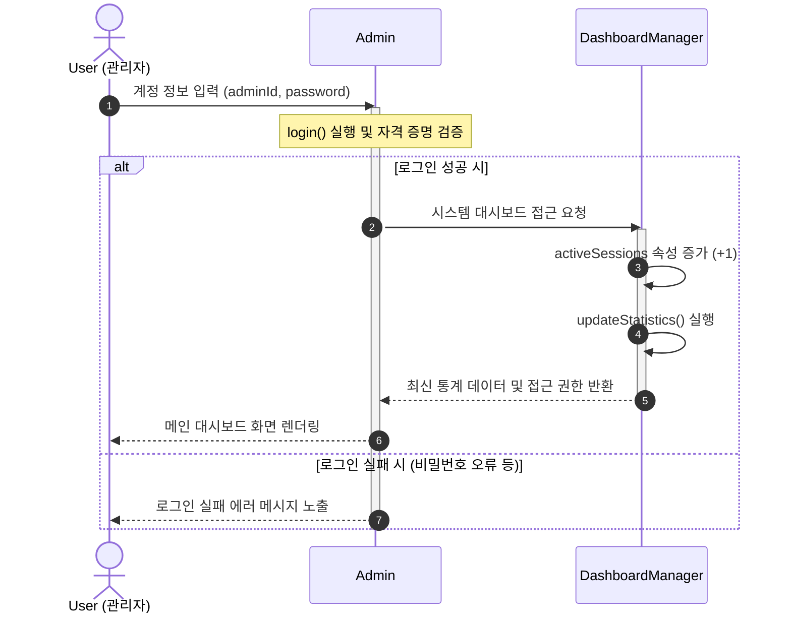
위 그림은 관리자가 시스템에 System Access하는 과정이다. 관리자가 로그인 요청을 보내면 내부적으로 Admin 클래스가 호출되어 입력받은 계정 정보를 DB와 대조하여 검증한다. 검증이 완료되면 서버는 해당 클라이언트(관리자)를 전담할 세션 스레드를 생성한다. 이후 DashboardManager에게 접속 성공을 알리며 세션 등록을 요청하는데 이때 DashboardManager는 내부 해시맵이나 리스트에 새로운 관리자의 세션 객체를 할당하고 시스템의 activeSessions 카운트를 1 증가 시킨다. 스레드 할당과 세션 등록이 완료된 클라이언트는 메인 대시보드 화면을 응답받아 모니터링을 시작한다.

**3.2 Core Banking Data Ingestion**
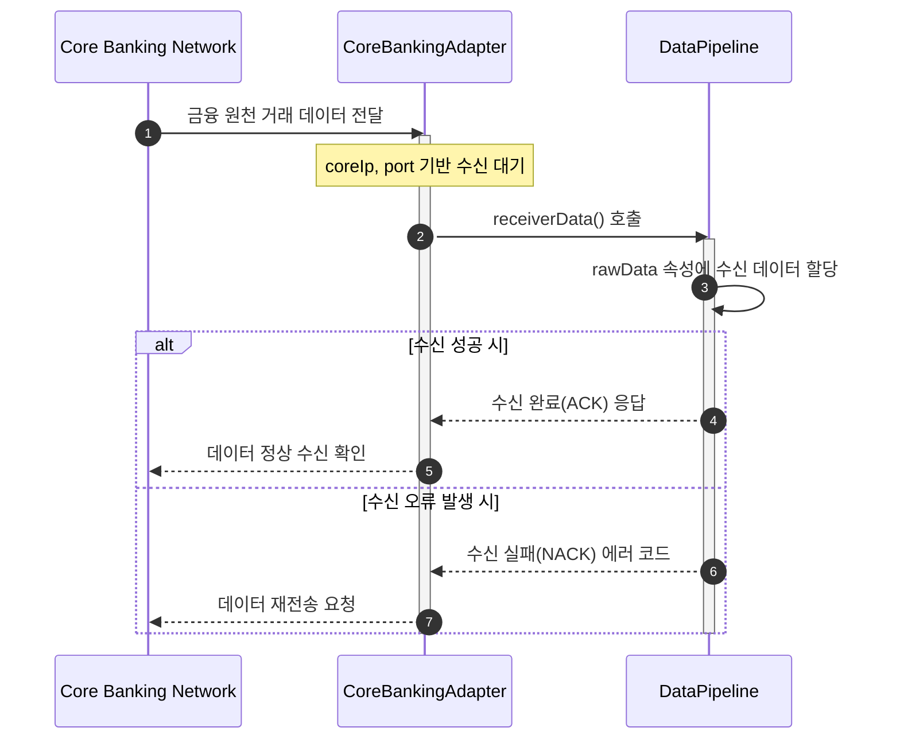

**3.3. Transaction Parsing & Pipeline Buffering**
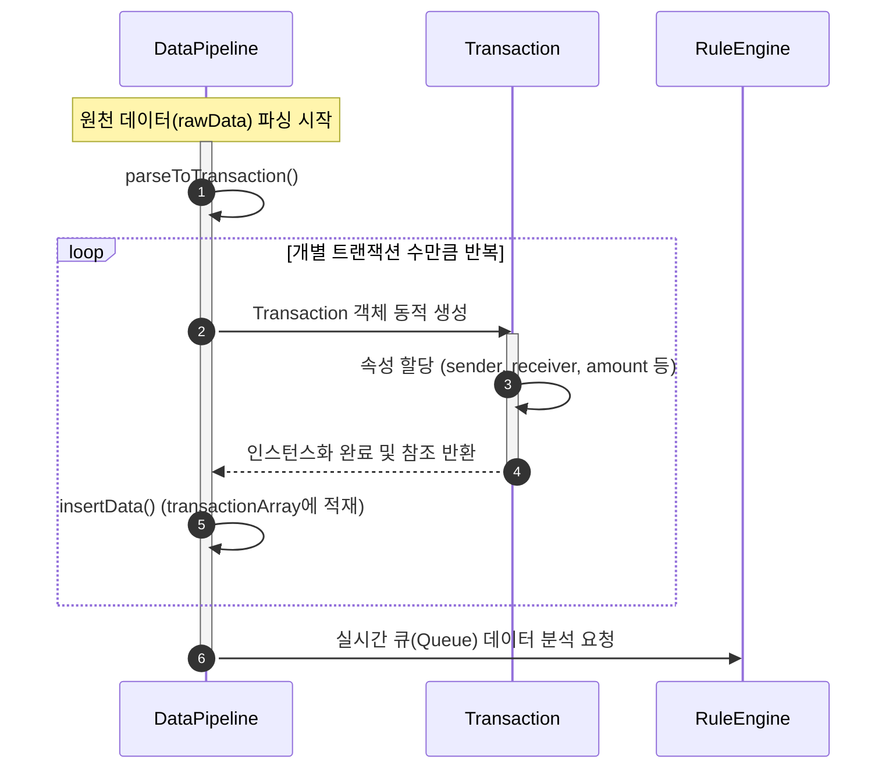

**3.4. High Amount Detection Process**
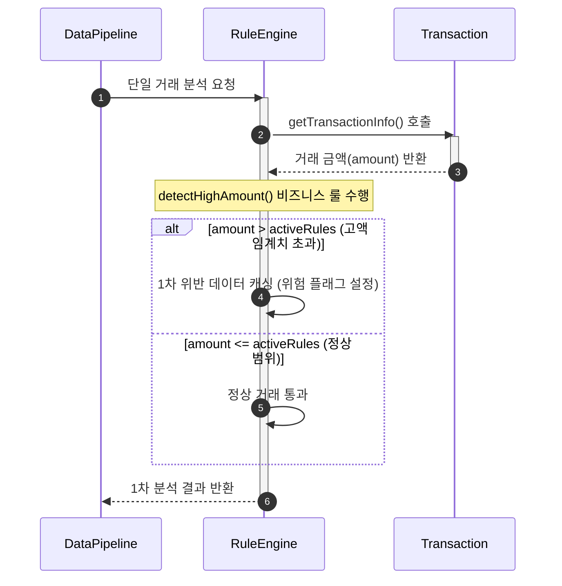

**3.5. Smurfing (Split Transfer) Detection Process**
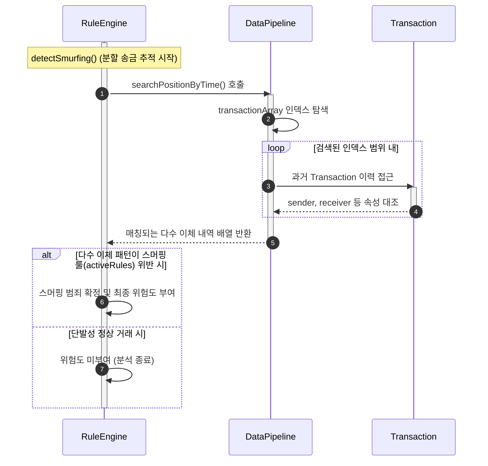

**3.6. Evidence Grouping & White-box Log Creation**
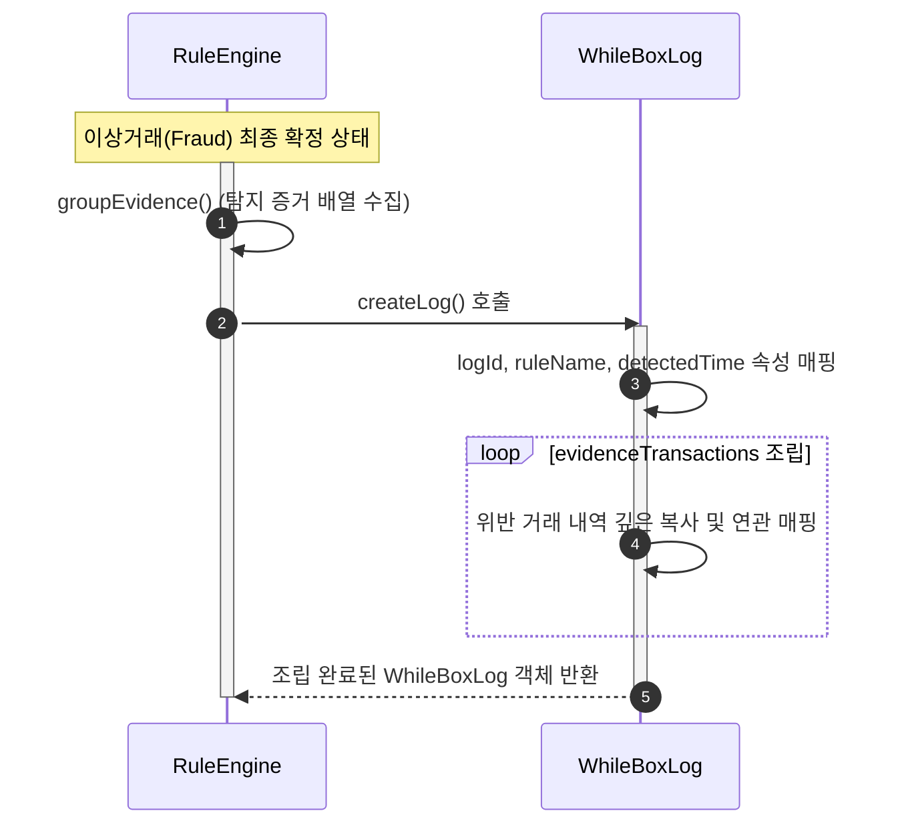

**3.7. Log Persistence & Database Storage**
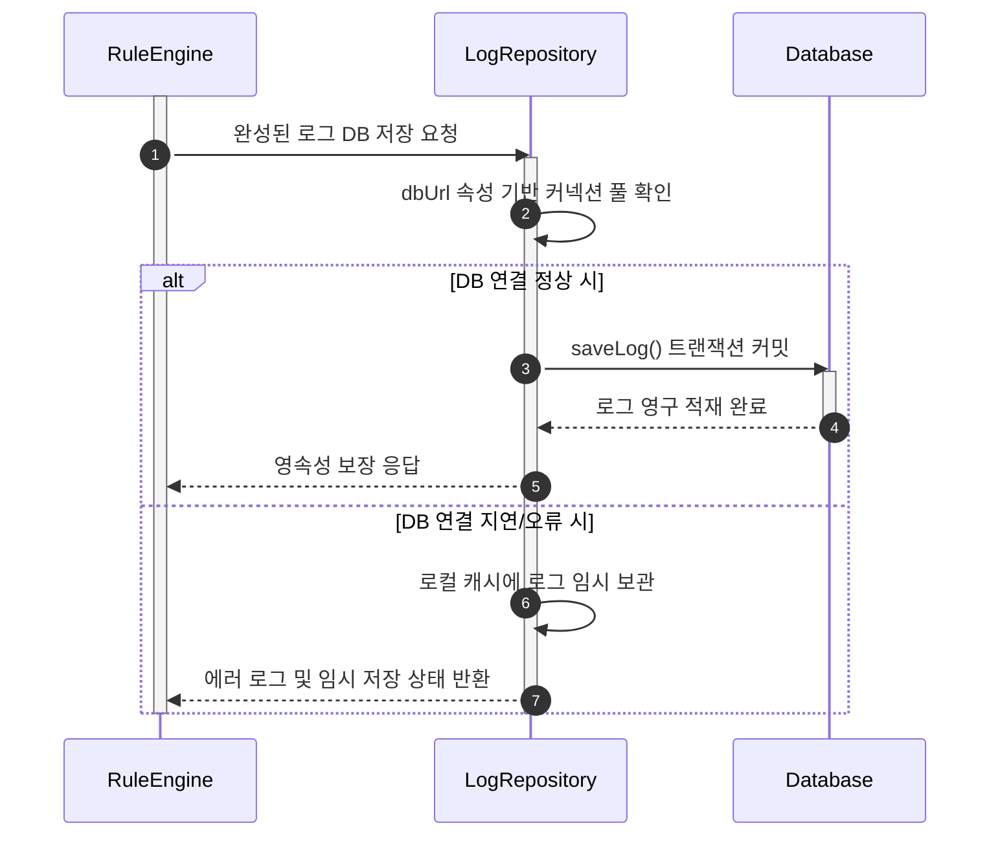

**3.8. Automated Block Command & Dashboard Alert**
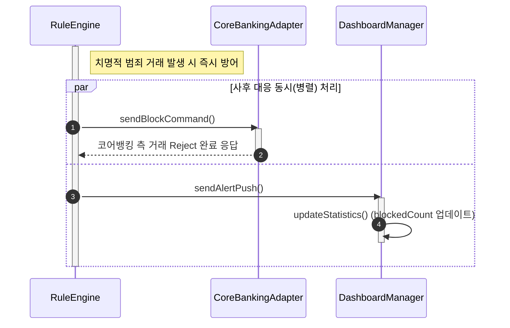

**3.9. FDS Log Data Inquiry & Audit**
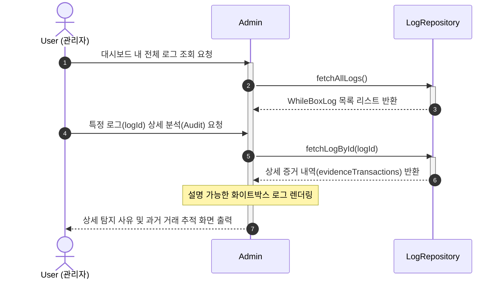

**3.10. Manual Account Lock Execution**
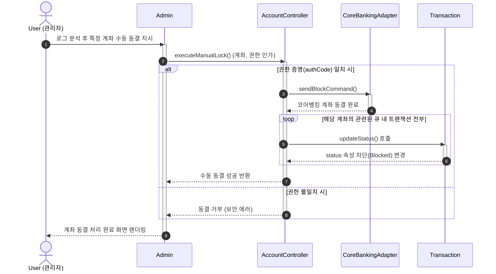

**3.11. Manual Account Unlock Execution**
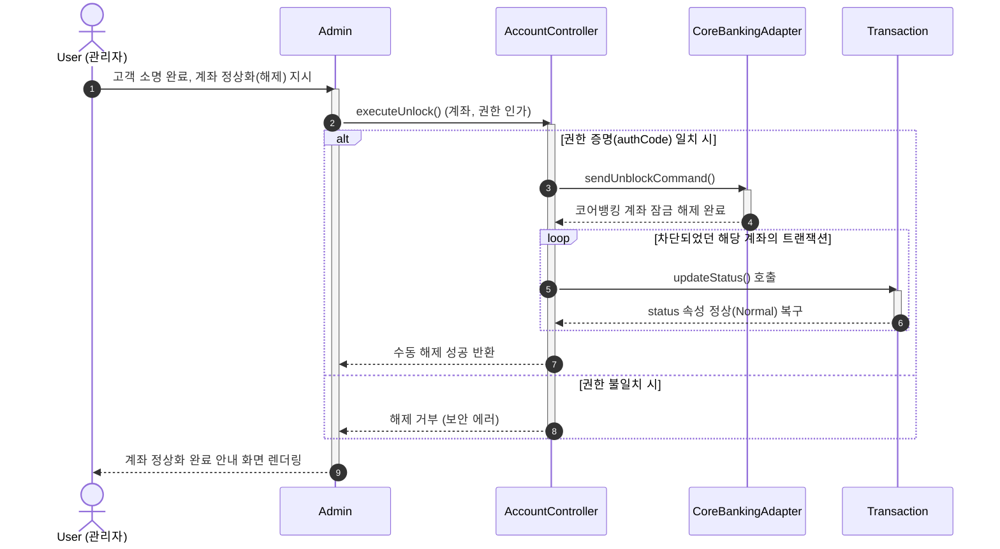

**3.12. Rule Setting Update & System Logout**
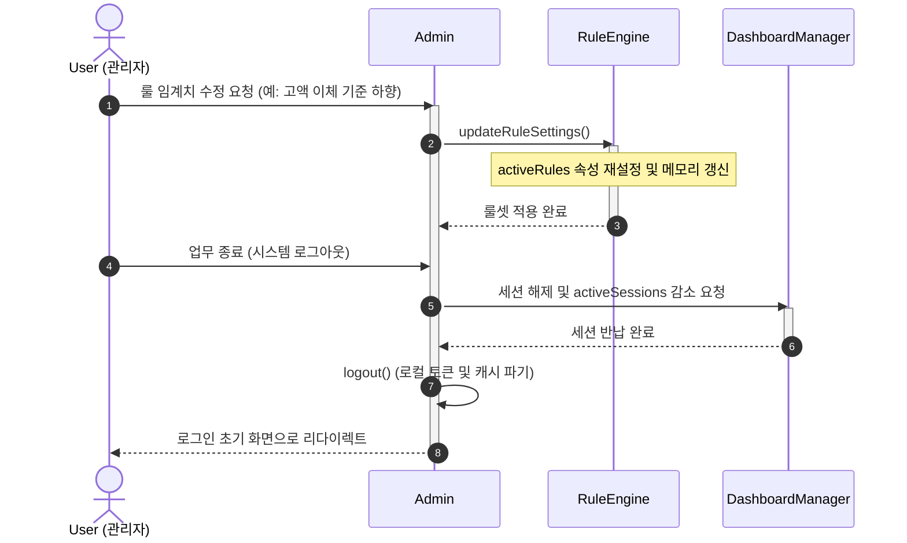
---

## 4. State machine diagram

**4.1 state machine diagram**

**4.2 detail of state machine diagram**

---

## 5. Implementation requirements

---

## 6. Glossary

---

## 7. References

---
